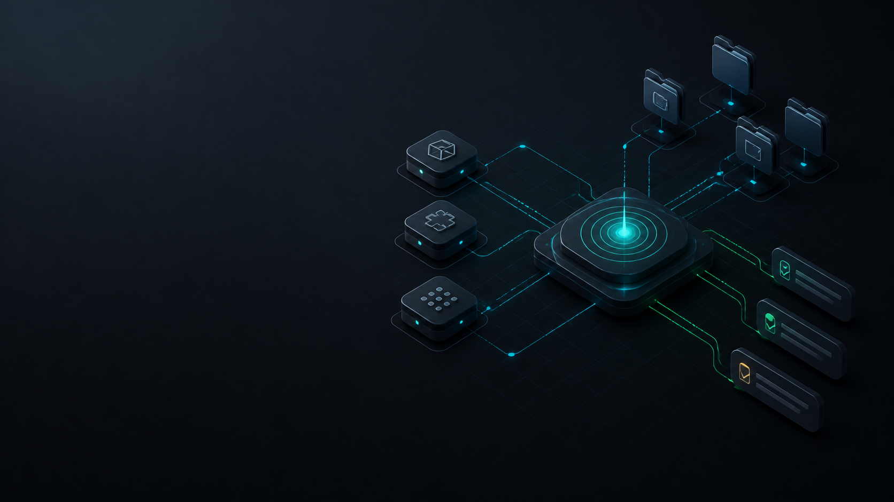
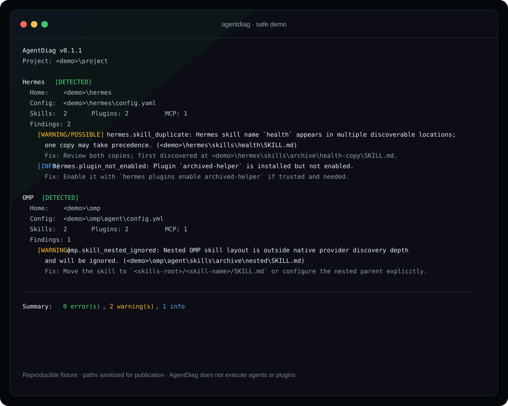

# AgentDiag

[](https://github.com/TheJarv1s/agentdiag/actions/workflows/ci.yml)
[](https://go.dev/)
[](LICENSE)

[English](README.md) | Русский



**AgentDiag** — CLI для диагностики окружений AI-агентов в режиме только чтения. Он обнаруживает **Hermes Agent** и **Oh My Pi (OMP)**, инвентаризирует skills, plugins и конфигурацию MCP, находит типичные проблемы discovery/конфигурации/безопасности и экспортирует санитизированные отчёты для поддержки.

**Текущая версия:** 0.1.1 · **Платформы:** Windows, macOS, Linux · **Go:** 1.22+

> AgentDiag не запускает бинарники агентов и не исполняет plugins, hooks, modules или skills.

## Зачем это нужно

В окружении агента быстро накапливаются skills, plugins, MCP-серверы, project overrides и provider-конфигурация в нескольких каталогах. Когда что-то перестаёт загружаться, недостаточно узнать, существует ли файл: будет ли он найден агентом, включён ли он и структурно ли корректна конфигурация?

AgentDiag отвечает на эти вопросы, не изменяя обследуемое окружение.

## Что проверяется

- Обнаружение Hermes и OMP в Windows, macOS и Linux.
- Пользовательские, проектные и managed skills там, где это применимо.
- Hermes plugins и runtime-состояние OMP plugins.
- Нативные MCP server definitions и корректность OMP MCP JSON.
- Дубли skills и вложенные OMP layouts, которые нативный discovery игнорирует.
- Включённость Hermes plugins и выбранные security-sensitive settings.
- Credential-like YAML literals только по **пути ключа** — значение никогда не выводится.
- Unix-права secret-файлов, terminal output и экспорт JSON/Markdown.

## Установка

```bash
go install github.com/TheJarv1s/agentdiag/cmd/agentdiag@latest
```

Или сборка из исходников:

```bash
go build -o agentdiag ./cmd/agentdiag
```

Windows PowerShell:

```powershell
go build -o agentdiag.exe ./cmd/agentdiag
```

## Быстрый старт

```bash
agentdiag scan
agentdiag doctor
agentdiag security
agentdiag export --format markdown --output agentdiag-report.md
```

По умолчанию текущий каталог считается проектом, поэтому включается project-local состояние `.hermes` и `.omp`.

## Реальный безопасный demo

В репозитории есть [безопасный demo fixture](examples/safe-demo/README.md): в нём нет credentials и персональных путей. Запустите из корня репозитория:

```bash
go run ./cmd/agentdiag scan \
  --project ./examples/safe-demo/project \
  --hermes-home ./examples/safe-demo/hermes \
  --omp-home ./examples/safe-demo/omp
```



Скриншот создан из этой команды; для публикации пути заменены на `<demo>`. См. [санитизированный захваченный вывод](examples/safe-demo/terminal-output.txt).

## CLI

```text
agentdiag [scan] [flags]
agentdiag doctor [flags]
agentdiag security [flags]
agentdiag export --format markdown|json --output FILE [flags]
agentdiag version
```

Основные overrides:

```text
--project PATH
--hermes-home PATH
--omp-home PATH
--omp-agent-dir PATH
--format terminal|json|markdown
```

## Уверенность диагностики и границы

AgentDiag различает подтверждённые структурные находки и эвристики. Эвристики помечаются как `POSSIBLE` (например, `[WARNING/POSSIBLE]`). В v0.1.1 парсер `SKILL.md` frontmatter намеренно работает fail-open: неподдерживаемый YAML не объявляется невалидным лишь потому, что его не может представить лёгкий парсер.

Для Hermes AgentDiag понимает `plugins.enabled`, `plugins.disabled`, `mcp_servers`, выбранные настройки безопасности skills, plugin manifests, рекурсивные skill trees, активные `_org` mirrors и настроенные `skills.external_dirs`.

Для OMP AgentDiag обследует пользовательский слой (обычно `~/.omp/agent`) и `.omp` слой текущего проекта, включая skills, managed skills, MCP-файлы и runtime plugin state. Поддерживаются `PI_CODING_AGENT_DIR` и существующие XDG OMP plugin data.

Текущее ограничение: v0.1.1 инвентаризирует Hermes skill files, доступные discovery. Он не эмулирует все trusted-project quarantine и platform/environment filters, поэтому наличие skill в списке не гарантирует его активность в текущей сессии.

## Приватность и безопасность

AgentDiag намеренно консервативен:

- доступ к файловой системе только на чтение;
- не вызывает бинарники агентов;
- не исполняет plugins/modules;
- не читает значения `.env`;
- не включает credential values в отчёты;
- literal-secret detection выводит только путь ключа, например `providers.demo.api_key`.

Проверяйте отчёт перед публикацией: пути и имена plugins/skills могут раскрывать проект или username. См. [SECURITY.md](SECURITY.md) с security policy и гарантиями.

## Разработка и релизы

```bash
go test ./...
go vet ./...
go build -trimpath ./cmd/agentdiag
```

Release builds записываются в `dist/` командой `make release`. Release notes v0.1.1, asset plan, GitHub metadata и promotion drafts находятся в [docs/launch](docs/launch/).

## Roadmap

- **v0.2:** адаптеры Claude Code, Codex и OpenCode.
- **v0.2:** оценки context/token overhead и более глубокие OMP marketplace checks.
- **v0.3:** machine-readable check registry, GitHub Actions mode и опциональный `--fix-plan`, который предлагает изменения, но не применяет их.

## Участие в разработке

Contributions приветствуются. Начните с [CONTRIBUTING.md](CONTRIBUTING.md); адаптеры должны оставаться read-only и не исполнять сторонний код.

## Лицензия

MIT. См. [LICENSE](LICENSE).
